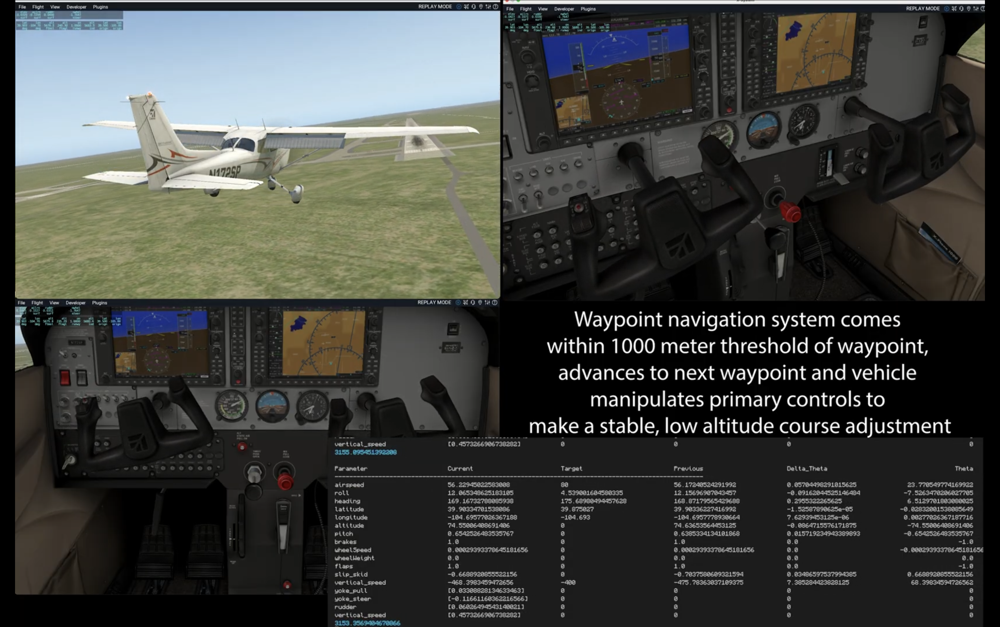

# Computational Pilot Model for Aircraft Approach and Landing

A closed-loop computational model of pilot control behavior integrated with **X-Plane**, developed as an undergraduate honors thesis at the University of Pennsylvania.

The project investigates computational modeling of pilot behavior during approach and landing by connecting a pilot model directly to a flight simulator, allowing aircraft state to feed back into subsequent control actions throughout the simulation.

## Demonstration

[](https://drive.google.com/file/d/1-zXgSHbq23a6gcKL4D1h9uxnbbCKlZY-/view?usp=sharing)

**[Watch the full demonstration video →](https://drive.google.com/file/d/1-zXgSHbq23a6gcKL4D1h9uxnbbCKlZY-/view?usp=sharing)**


## System Overview

The model operates in a closed loop with X-Plane:

**Aircraft State → Pilot Model → Flight Controls → X-Plane Dynamics → Updated Aircraft State → ...**

Aircraft-state telemetry is provided to the computational model, which generates control inputs using PI-based flight-control logic. These commands are applied within X-Plane, producing a new aircraft state that feeds the next iteration of the model.

The system was developed to autonomously execute multiple phases of approach and landing, including:

* Descent
* Flare
* Runway rollout
* Braking

## Real-World Flight Data

To compare simulated behavior with empirical flight behavior, the project incorporates the **General Aviation Time Series (GATS)** dataset:

* **~50 GB** of flight data
* **7,000+ flights**
* **10,641 flight hours**
* **76 sensor parameters**

Python/Pandas time-series pipelines were developed to extract relevant flight phases, generate model initial conditions, and support comparisons between real-world flight behavior and **50+ simulator runs**.

## Modeling & Simulation

MATLAB and Simulink models were used to design and tune control behavior and evaluate:

* Closed-loop response
* Stability
* Target-value tracking
* Qualitative simulator behavior relative to real-world flight data

## Technical Stack

**Modeling & Analysis**
Python · Pandas · MATLAB · Simulink

**Simulation**
X-Plane · X-Plane SDK

**Systems / Integration**
C/C++ · Java

**Visualization & Analysis**
Matplotlib · Jupyter

## Architecture

```text
             ┌─────────────────────┐
             │    Pilot Model      │
             │                     │
             │  State Processing   │
             │         ↓           │
             │   Control Logic     │
             └──────────┬──────────┘
                        │
                  Control Inputs
                        │
                        ▼
             ┌─────────────────────┐
             │       X-Plane       │
             │                     │
             │  Aircraft Dynamics  │
             └──────────┬──────────┘
                        │
                 State Telemetry
                        │
                        └──────────────► feedback to model
```

Real-world flight data provides an additional empirical reference for initializing and evaluating simulation behavior:

```text
        GATS Flight Data
               │
               ▼
     Python/Pandas Pipeline
          ┌────┴────┐
          ▼         ▼
   Flight-Phase   Model Initial
    Extraction     Conditions
          │         │
          └────┬────┘
               ▼
       Simulation Analysis
               │
               ▼
     Real vs. Simulated
          Behavior
```

## Repository Structure

```text
.
├── src/
│   ├── model/             # Computational pilot model
│   └── xplane_plugin/     # X-Plane integration
│
├── analysis/
│   ├── empirical/         # Real-world flight-data analysis
│   ├── simulation/        # Simulation analysis
│   └── comparison/        # Real vs. simulated behavior
│
├── figures/               # Selected figures and visualizations
└── README.md
```

## Research Context

This project began in August 2024 as an undergraduate honors thesis spanning **Computer Science and Cognitive Science** at the University of Pennsylvania.

The broader goal was to explore how computational models of human control behavior can interact directly with dynamic simulation environments and how their resulting behavior can be evaluated against empirical aviation data.

## Author

**Christopher S. Powell**
University of Pennsylvania
Computer Science & Cognitive Science
Commercial Pilot · Instrument Rated · Advanced Ground Instructor
